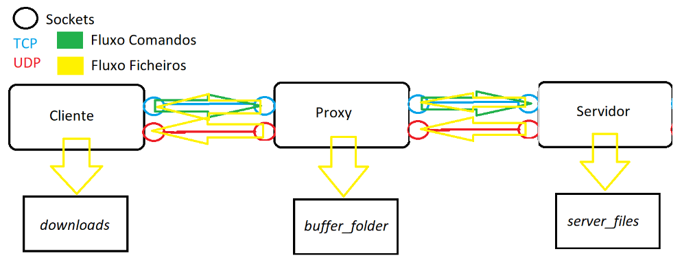

# Networks Assignment

___

## Used Technologies :computer:

 

___

##    About :clipboard:

A TCP and UDP data transfer application that allows you to request data (encripted or not) from a server using TCP or UDP protocols.

It also allows you to intercepting it with a proxy server.

Here's an illustration



___

##    Running it :running:

- Run server
```bash
gcc -Wall server.c -o server
./server <port> <max clients>
```

- Run proxy
```bash
gcc -Wall proxy.c -o proxy
./proxy <port>
...
show # prints the client and server IP addresses, ports and used transfer protocol (TCP/UDP)
save # (dis)ables the backup option, this is, saving the last sent file
losses <number> # define the percentage of lost bytes during an UDP transfer
```


- Run client
```bash
gcc -Wall client.c -o client
./client <proxy address> <server address> <port> <UDP/TCP>
...
list # sends a file listing request to the server
quit # shuts down the client
download <tcp/udp> <enc/nor> file_name # downloads a file from the server and saves it on downloads folder
```

___

## **Contributors** :sparkles:

<html><i><b> Licenciatura Engenharia Informática - Universidade de Coimbra<br>
Introdução às Redes de Comunicação - 2019/2020 <br>
Coimbra, 17 de dezembro de 2019
</b></i></html>

:mortar_board: *[Rodrigo Sobral](https://github.com/RodrigoSobral2000)*
:mortar_board: *[Gustavo Bizarro](https://github.com/gtb200)*

___

## License :link:
Have a look at the [license file](LICENSE) for details
___
